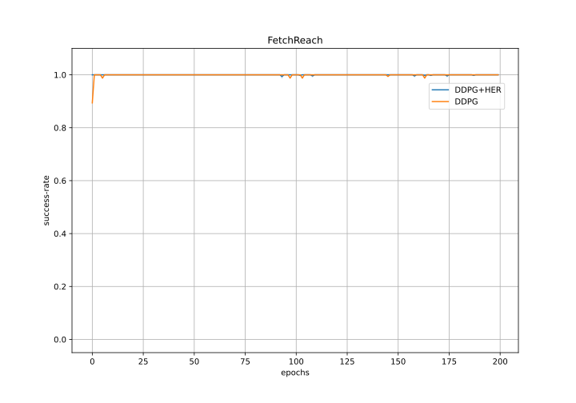
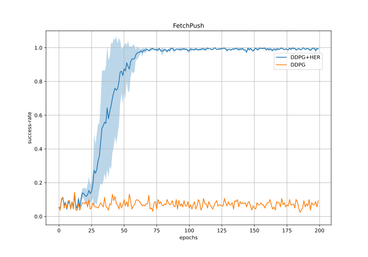
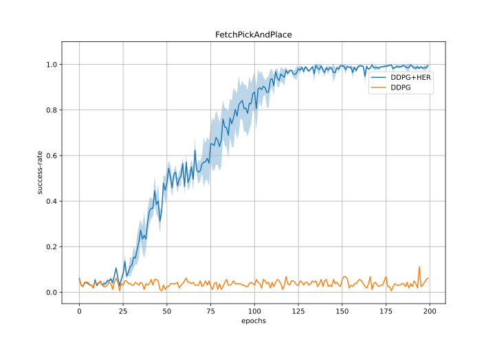
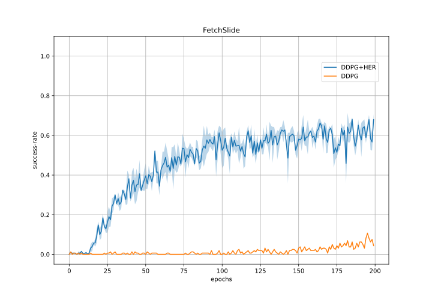
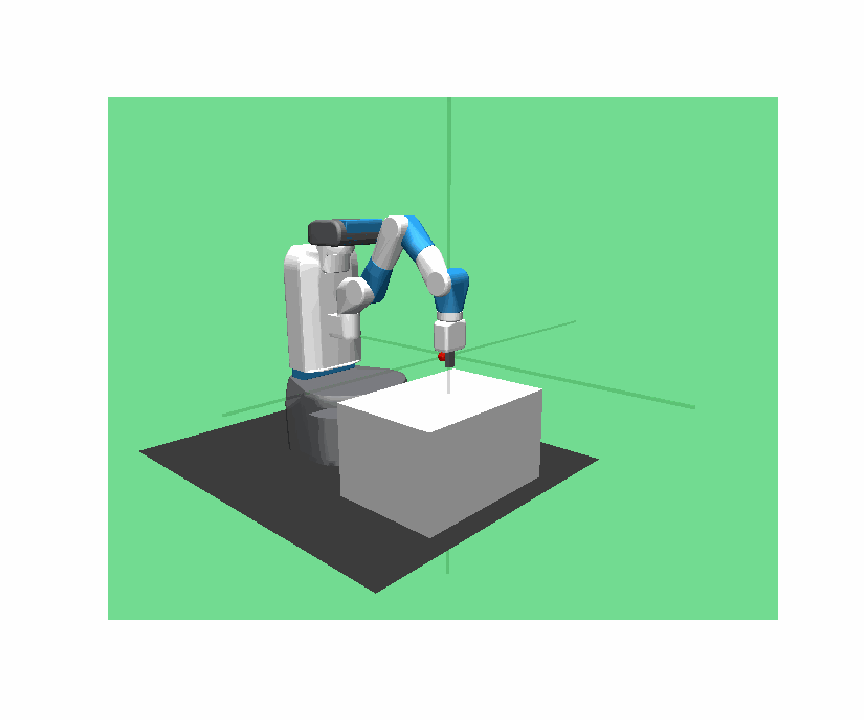
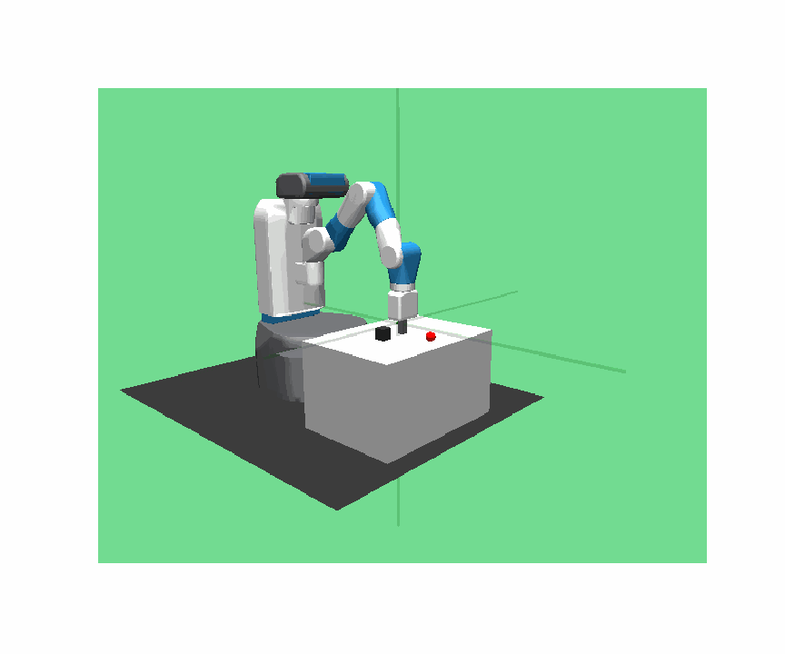
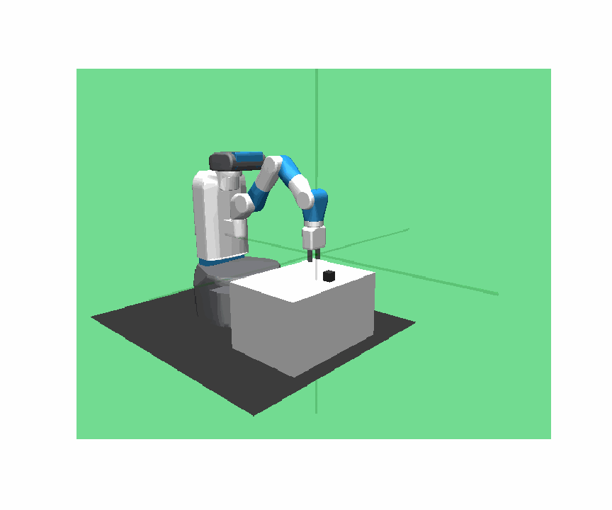
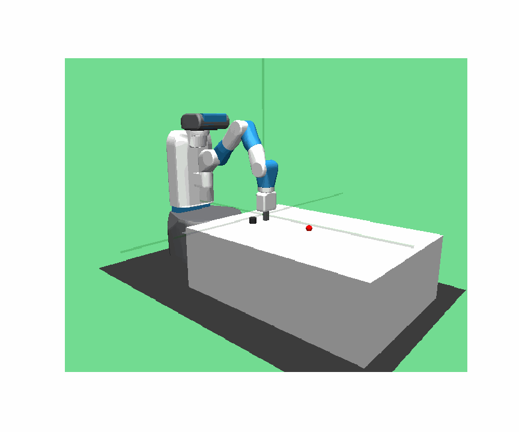

# Fetch Robotic Gym Environment solved in Pytorch with DDPG+HER

Used Algorithms:
- Deep Deterministic Policy Gradient (DDPG)
- DDPG with Hindsight Experience Replay (DDPG+HER)

My Bachelor's Thesis about RL and Hindsight Experience Replay can be viewed [here](https://drive.google.com/file/d/1ayOb9t2dB-XccyOEDicSLH-0CBFeeaDr/view).  
The results for different seeds, its plotting methods and a demo jupyter notebook of trained agents are available on the _results_ branch.

### Environments

There are 4 different tasks to be solved in the openai robotic Fetch gym (arm with 7 DOF), with the mujoco physics simulator:
 - Reach  (observation space: 10 observations, 3 achieved goal, 3 desired goal)
 - Push  (observation space: 25 observations, 3 achieved goal, 3 desired goal)
 - PickAndPlace  (observation space: 25 observations, 3 achieved goal, 3 desired goal)
 - Slide  (observation space: 25 observations, 3 achieved goal, 3 desired goal)

in a episode of 50 timesteps, where the target position is always visualised in red.

For every timestep where the target position is not reached, the agent receives an reward of -1. If the agent fails to reach the goal until the end of an episode it is considered unsuccessful.

The action-space is a vector of 4 values (x,y,z, gripper), the gripper value is irrelevant for all environements except for PickAndPlace.

The DDPG algorithm with standard experience replay fails to learn in these environements (except for FetchReach-v1), however with [Hindsight Experience Replay](https://arxiv.org/abs/1707.01495) (HER) all the tasks can be solved.

### Results

Below you can see the success-rate over 200 epochs (1 epoch = 50 cycles = 16 episodes) for all the different Fetch environments (and random seed = 0). FetchReach-v1 is sovled in less than one epoch and can be solved with vanilla DDPG (without HER). Training 200 epochs with 16 parallel workers takes approximately 3 hours.

FetchReach-v1| FetchPush-v1
-----------------------|-----------------------|
| 

FetchPickAndPlace-v1| FetchSlide-v1
-----------------------|-----------------------|
| 

### Watch trained agents:

FetchReach-v1| FetchPush-v1
-----------------------|-----------------------|
| 

FetchPickAndPlace-v1| FetchSlide-v1
-----------------------|-----------------------|
| 

### Files in this Repository
                    
    .
    ├── tmp_results/                       # folder for storing new results
    ├── trained/                           # stored gifs, weights for trained networks and results for different seeds 
    ├── agent_demo.ipynb                   # demonatrating the environment and results inside a iPython notebook 
    ├── ddpg.py                            # DDPG agent implmented
    ├── her_sampler.py                     # generating HER samples from episodes in replay-buffer
    ├── main.py                            # main code where training setup is defined
    ├── model.py                           # Pytorch model (3 hidden layers, 256 nodes each)
    ├── parallelEnvironment.py             # vectorize environement for paralllel computing (from openai baselines subprocvec)
    ├── replay_buffer.py                   # buffer to store experiences (as episodes)
    ├── rollout.py                         # worker to generate episodes of experiences
    ├── utils.py                           # generate iPython display viewer (also saving gifs); online normalizer for network input
    └── README.md
    
### Relevant Papers and Acknowledgements
 > [Hindsight Experience Replay](https://arxiv.org/abs/1707.01495) 
 
 > [Continuous control with deep reinforcement learning](https://arxiv.org/abs/1509.02971)
 
 > [Openai baselines](https://github.com/openai/baselines)

### Python Packages
 - abc
 - collections
 - copy
 - gym
 - IPython  (for displaying environment in notebook)
 - matplotlib
 - multiprocessing
 - mujoco
 - numpy
 - random
 - threading
 - torch
 - progressbar   (for tracking time during training)

